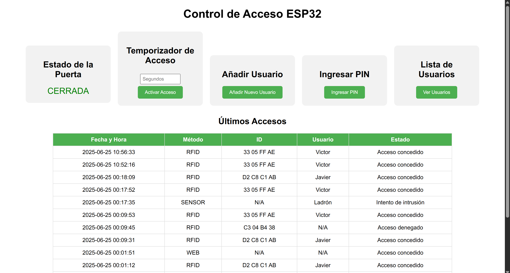
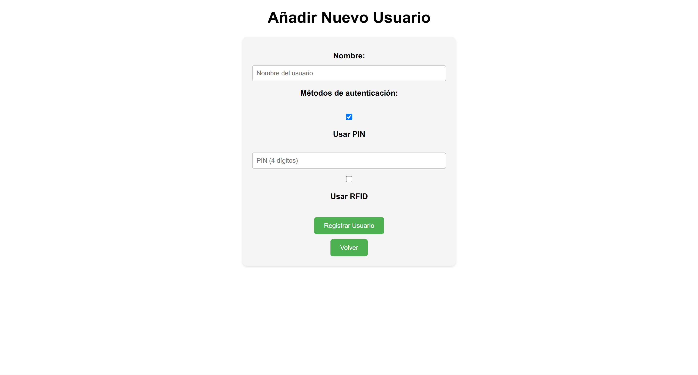
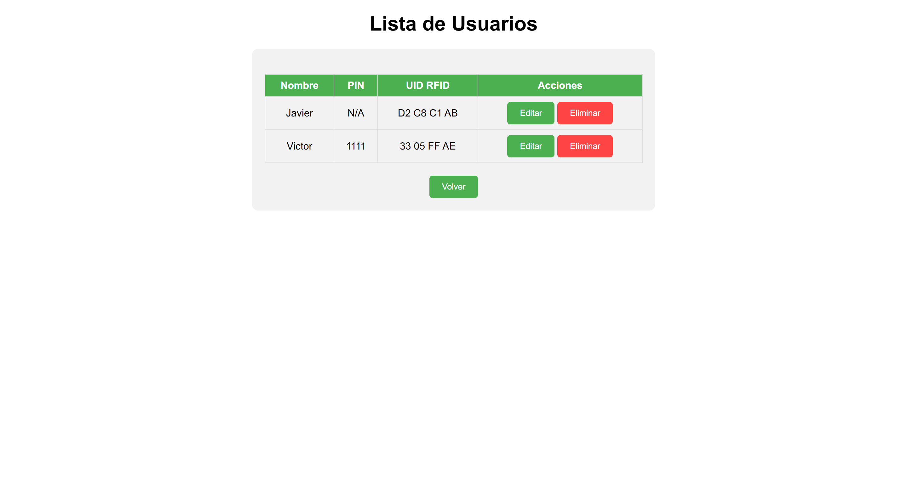
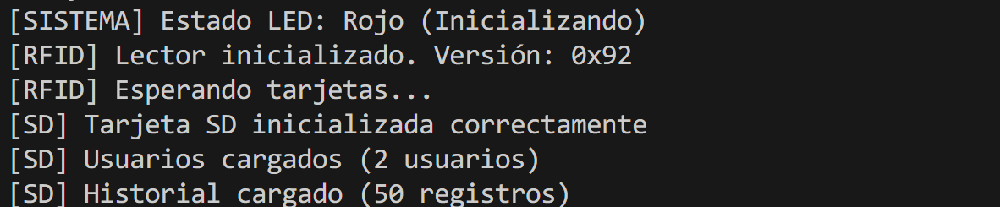
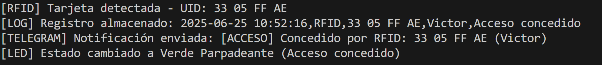
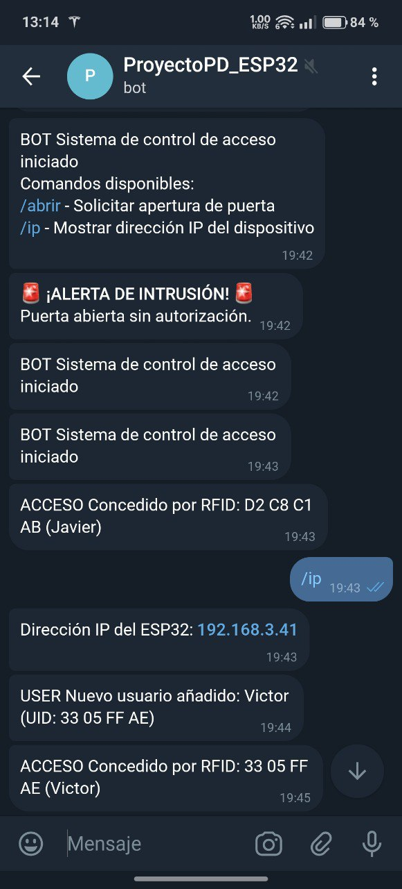
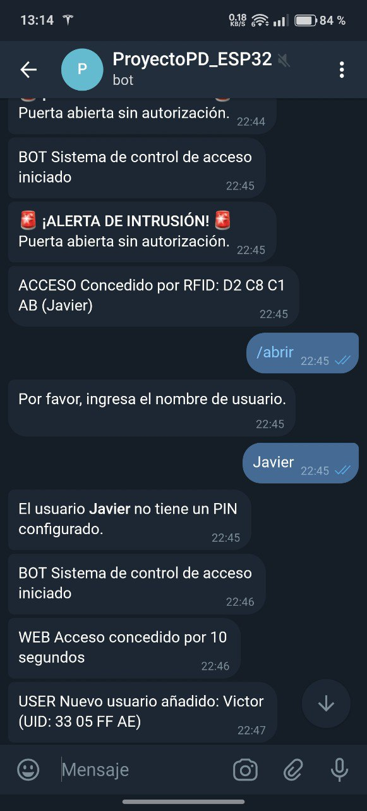
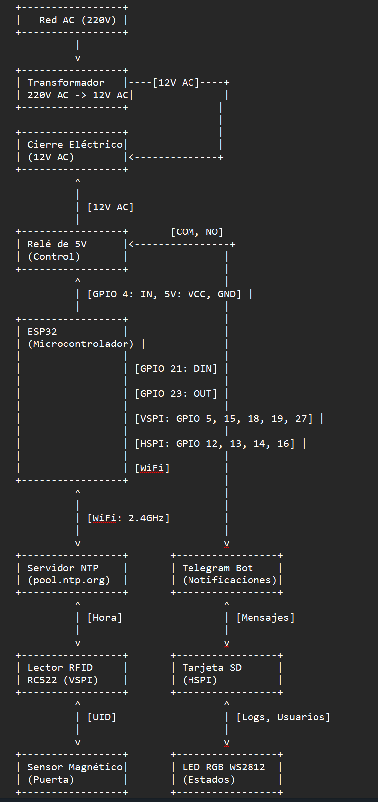

Javier González Montesinos

**Informe del Proyecto: Sistema de Control de Acceso con ESP32**

**Resumen Ejecutivo:**

Este proyecto consiste en el desarrollo de un sistema de control de acceso basado en el microcontrolador ESP32, diseñado para gestionar el acceso a un despacho/habitación/vivienda mediante múltiples métodos de autenticación: RFID, PIN, Telegram y panel de control web. El sistema incluye un servidor web para configuración y monitoreo, registro de eventos guardados en tarjeta SD, notificaciones en tiempo real vía Telegram, y un LED RGB para indicar el estado del sistema en directo.
Este informe detalla los objetivos, la implementación, los desafíos enfrentados, las soluciones aplicadas y las lecciones aprendidas durante el desarrollo.

**Objetivos del Proyecto**

Gestión del sistema de acceso a través del panel de control web: implementar un sistema que permita gestionar diferentes usuarios (dar de alta, dar de baja, editar, etc) los diferentes usuarios que deben de tener acceso.
Además, este panel de control web nos debe de mostrar un historial de los últimos 15 eventos registrados que han sido previamente guardados en una tarjeta SD incluyendo fehca, método de apertura, usuario y estado del acceso en ese momento.

Indicadores Visuales: Utilizar un LED RGB para reflejar el estado del sistema (rojo: acceso restringido, verde parpadeante: acceso concedido, amarillo: puerta abierta con permiso concedido, rojo parpadeante: intrusión).

Notificaciones: Enviar alertas en tiempo real a través de Telegram para accesos, intrusiones y cambios de configuración además de poder consultar en que dirección IP se encuentra el panel de control web.

Escalabilidad: Diseñar un sistema modular que permita futuras mejoras, como soporte para más usuarios o métodos de autenticación. Dentro del panel de control web se podrán gestionar los usuarios ya existentes para modificar sus métodos de apertura así como poder eliminarlos si se desea.

**Descripción Técnica**

Hardware Utilizado con precio y link de compra:

| Componente y precio aprox (EUR)| Descripción | Enlace en AliExpress | 
|--------------------------------|-------------|----------------------|
| ESP32-WROOM-32D (4,15€)   | Microcontrolador principal con soporte para WiFi, monitor serie a través de USB y posibilidad de conectar múltiples periféricos a través de sus pines GPIO. | [ESP32-WROOM-32D (AliExpress)](https://es.aliexpress.com/item/1005006468877648.html?spm=a2g0o.productlist.main.8.2dd8742e8G8MXP&algo_pvid=53e21e8f-1433-47d5-84aa-12dd9e21cac0&algo_exp_id=53e21e8f-1433-47d5-84aa-12dd9e21cac0-7&pdp_ext_f=%7B%22order%22%3A%221602%22%2C%22eval%22%3A%221%22%7D&pdp_npi=4%40dis%21EUR%2115.29%214.42%21%21%21124.39%2135.92%21%40211b612517508484107785084e705d%2112000037307068121%21sea%21ES%211861771646%21X&curPageLogUid=f6aBYpSn908r&utparam-url=scene%3Asearch%7Cquery_from%3A)
| Cables de conexión Dupont (3,67€) | Para conectar los componentes al ESP32 | 
[Cables de conexión Dupont (AliExpress)](https://es.aliexpress.com/item/1005007072081464.html?spm=a2g0o.productlist.main.1.4e8593oo93ooo5&algo_pvid=d4b405c6-ca49-49ea-92a1-08f0c1c8a9ad&algo_exp_id=d4b405c6-ca49-49ea-92a1-08f0c1c8a9ad-0&pdp_ext_f=%7B%22order%22%3A%2211990%22%2C%22eval%22%3A%221%22%7D&pdp_npi=4%40dis%21EUR%213.67%211.10%21%21%2129.83%218.95%21%4021038df617508481769608584ee9ad%2112000039311521756%21sea%21ES%211861771646%21X&curPageLogUid=zpMWE6qkzxoK&utparam-url=scene%3Asearch%7Cquery_from%3A)|
| Lector RFID RC522 (4,64€)  | Permite la lectura y autenticación mediante tarjetas RFID e identificar las tarjetas/llaveros RFID que se acerquen al lector. |
[Lector RFID RC522 (AliExpress)](https://es.aliexpress.com/item/1005006894076021.html?spm=a2g0o.productlist.main.3.43ee1d24Bmt222&algo_pvid=08a67a97-cdc9-4d8e-8937-2b772390ca54&algo_exp_id=08a67a97-cdc9-4d8e-8937-2b772390ca54-2&pdp_ext_f=%7B%22order%22%3A%22672%22%2C%22eval%22%3A%221%22%7D&pdp_npi=4%40dis%21EUR%214.64%211.30%21%21%2137.78%2110.58%21%402103890917508482489366511ec01d%2112000038645364936%21sea%21ES%211861771646%21X&curPageLogUid=mPk4hdHFWPKb&utparam-url=scene%3Asearch%7Cquery_from%3A)|
| Tarjetas/llaveros RFID  | Componente que debe llevar cada usuario registrado para poder acceder, se puede utilizar varios si se desea que hayan múltiples usuarios registrados a la vez, cada tarjeta/llavero está registrado a un usuario en concreto. |Incluido con el lector RC522|
| Módulo tarjeta SD (3,52€)  | Almacenamiento de usuarios y logs de acceso. |
[Módulo tarjeta SD (AliExpress)](https://es.aliexpress.com/item/1005009104472565.html?spm=a2g0o.productlist.main.1.3b6by36wy36w5c&algo_pvid=bbe07b92-502b-40b8-9244-499c5f56fd1d&algo_exp_id=bbe07b92-502b-40b8-9244-499c5f56fd1d-0&pdp_ext_f=%7B%22order%22%3A%2211%22%2C%22eval%22%3A%221%22%7D&pdp_npi=4%40dis%21EUR%218.49%213.99%21%21%2169.08%2132.46%21%402103956a17508488921707274ec532%2112000047926921709%21sea%21ES%211861771646%21X&curPageLogUid=Fz2OzzLN7GZX&utparam-url=scene%3Asearch%7Cquery_from%3A)|
| Sensor magnético (4,26€)  | Detecta el estado de la puerta (abierta/cerrada). |
[Sensor magnético (AliExpress)](https://es.aliexpress.com/item/1005006443999861.html?spm=a2g0o.productlist.main.1.4fb28bb4FW8pij&algo_pvid=5831ad47-3504-4be8-b9f0-90ae537fb29d&algo_exp_id=5831ad47-3504-4be8-b9f0-90ae537fb29d-0&pdp_ext_f=%7B%22order%22%3A%22280%22%2C%22eval%22%3A%221%22%7D&pdp_npi=4%40dis%21EUR%214.79%214.79%21%21%215.44%215.44%21%402103894417508490185143997e6ec5%2112000037187115721%21sea%21ES%211861771646%21X&curPageLogUid=6zDnN21NXTIO&utparam-url=scene%3Asearch%7Cquery_from%3A)|
| Relé 5V (0,98€)  | Controla el cierre eléctrico de apertura de la puerta permitiendo o no el acceso. |
[Relé 5V (AliExpress)](https://es.aliexpress.com/item/1005005622532797.html?spm=a2g0o.productlist.main.1.4cccjJg5jJg5e3&algo_pvid=aad754dc-b300-4764-bc9f-c4d54a89b865&algo_exp_id=aad754dc-b300-4764-bc9f-c4d54a89b865-0&pdp_ext_f=%7B%22order%22%3A%22134%22%2C%22eval%22%3A%221%22%7D&pdp_npi=4%40dis%21EUR%210.98%210.98%21%21%211.11%211.11%21%40211b813f17508490893568832e6249%2112000033780629893%21sea%21ES%211861771646%21X&curPageLogUid=BNWV69tgoP5b&utparam-url=scene%3Asearch%7Cquery_from%3A)|
| Cierre eléctrico 12V AC/DC (32,30€)  | Controla el cierre eléctrico de apertura de la puerta permitiendo o no el acceso. |
[Cierre eléctrico 12V AC/DC (AliExpress)](https://es.aliexpress.com/item/1005007873353613.html?spm=a2g0o.productlist.main.1.73dd4a24KCZTyQ&algo_pvid=3c143f42-91f9-49e9-bc83-8e2913ff2f68&algo_exp_id=3c143f42-91f9-49e9-bc83-8e2913ff2f68-0&pdp_ext_f=%7B%22order%22%3A%22-1%22%2C%22eval%22%3A%221%22%7D&pdp_npi=4%40dis%21EUR%2132.30%2132.30%21%21%2132.30%2132.30%21%40210384cc17508492326112423ec884%2112000042647301172%21sea%21ES%211861771646%21X&curPageLogUid=ZCR2egDE7qwX&utparam-url=scene%3Asearch%7Cquery_from%3A)|
| Transformador 220v a 12v AC (2,53€)  | Bajamos el voltaje de 220V a 12V en AC. |
[Transformador 220v a 12v AC (AliExpress)](https://es.aliexpress.com/item/1005002628884428.html?spm=a2g0o.productlist.main.46.5a42rEN4rEN4F0&algo_pvid=ae1fa1bc-acd9-424e-bfc3-86bbf4427823&algo_exp_id=ae1fa1bc-acd9-424e-bfc3-86bbf4427823-45&pdp_ext_f=%7B%22order%22%3A%2276%22%2C%22eval%22%3A%221%22%7D&pdp_npi=4%40dis%21EUR%213.40%213.09%21%21%213.86%213.51%21%40211b617b17508496500661401e0f75%2112000021472928823%21sea%21ES%211861771646%21X&curPageLogUid=EkwAtDKfWoLQ&utparam-url=scene%3Asearch%7Cquery_from%3A)|
| LED RGB WS2812 (1,21€)  | Indicador visual del estado del sistema en tiempo real. |
[LED RGB WS2812 (AliExpress)](https://es.aliexpress.com/item/32560280169.html?spm=a2g0o.productlist.main.3.44a5UsPeUsPeUP&algo_pvid=14127786-4909-47c2-9536-ae83d81efc28&algo_exp_id=14127786-4909-47c2-9536-ae83d81efc28-2&pdp_ext_f=%7B%22order%22%3A%221532%22%2C%22eval%22%3A%221%22%7D&pdp_npi=4%40dis%21EUR%211.81%211.71%21%21%212.06%211.95%21%402103835e17508493473287653e36b2%2112000023008385172%21sea%21ES%211861771646%21X&curPageLogUid=wztD0ejbwy5T&utparam-url=scene%3Asearch%7Cquery_from%3A)|

**Software y Librerías**

Software:
Visual Studio Code: Software de programación creado por Microsoft usado para desarrollar este proyecto
PlatformIO: Entorno IDE hecho para Visual Studio Code y dedicado al desarrollo de proyectos usando placas "Embedded" como Arduino o ESP32, etc.
Arduino Framework: Programación del ESP32 en C++ usando parte del código abierto propio de Arduino.

Librerías:
Arduino: Gestión interna del hardware del ESP32.
WiFi y AsyncTCP: Conexión a red y servidor web asíncrono.
ESPAsyncWebServer: Gestión de solicitudes HTTP.
Adafruit_NeoPixel: Control del LED RGB.
UniversalTelegramBot y ArduinoJson: Comunicación con Telegram.
MFRC522: Interfaz con el lector RFID.
SD y SPI: Acceso a la tarjeta SD.
time: Sincronización de hora con servidor NTP.

**Sistema Operativo:**

Sin sistema operativo, ejecutado directamente en el ESP32. Se intentó integrar en una fase avanzada del proyecto FreeRTOS para mejorar la gestión de las diferentes funciones que realiza el ESP32 a la vez y optimizar el uso de los recursos usando el modo multinúcleo del ESP32 con tareas pero finalemente no fue posible debido a incopatibilidades con la estructura general del código del proyecyo y la comunicación con los dispositivos con protocolo SPI.

**Funcionalidades Implementadas**

Servidor Web:
Página principal con estado de la puerta, temporizador, historial y accesos a otras funciones.
Gestión de usuarios: añadir, editar, eliminar (protegido por contraseña). EN el caso de querer añadir un usuario nuevo, se puede escoger si se quiere tener sólo el método PIN o el método RFID o ambos para permitir el acceso.

Diferentes métodos de autenticación:
RFID: Lee tarjetas y verifica el UID contra una lista de usuarios autorizados.
PIN: Permite ingreso de un PIN de 4 dígitos a través de la interfaz web.
Telegram: Autenticación remota mediante comando /abrir, nombre de usuario y PIN.
Temporizador Web: Activa el relé por un tiempo configurable (1-3600 segundos).

Registro de Eventos:
Almacena hasta 15 eventos en memoria y en archivo /access_log.txt en la SD.
Formato: Fecha y Hora,Método,ID,Usuario,Estado.

Indicadores LED:
Rojo sólido: Acceso restringido.
Verde parpadeante: Acceso concedido, puerta cerrada.
Amarillo sólido: Acceso concedido, puerta abierta.
Rojo parpadeante: Intrusión detectada (puerta abierta sin autorización).

Notificaciones Telegram:
Alertas para accesos concedidos/denegados, intrusiones y cambios en usuarios.
Comando /ip para obtener la IP del ESP32.
Comando /abrir para el acceso a través de los usuarios registrados. Una vez ejecutado el comando el BOT nos pide el nombre de usuario y posteriormente el PIN y, si éste no tiene método PIN registrado, nos mandará un aviso de que no se permite el acceso a través de Telegram de usuario sin PIN. Una vez concedido o denegado el acceso, se verá reflejado en el historial de accesos reflejando el usuario y el método utilizado.

Sincronización de Hora: Usa el servidor NTP para registrar eventos con timestamps precisos, permite la sincronización de la fecha y hora cada vez que establece conexión a Internet.

**Ejemplos de la interfaz WEB, salida monitor serie, comunicación por Telegram y conexión física del hardware**

Pantalla principal interfaz de control WEB

Proceso para añadir un usuario nuevo

Lista de usuarios registrados

Salida monitor serie inicio

Salida monitor serie detección RFID

Comunicación mediante BOT Telegram

**Cableado de los componentes al ESP32**

| Componente         | Pin del componente | Pin del ESP32 | Descripción                              |
|--------------------|--------------------|---------------|------------------------------------------|
| RFID RC522         |  SDA (SS)          |  GPIO 15      | Selección de chip para SPI (VSPI).       |
|                    |  SCK               |  GPIO 5       | Reloj SPI (VSPI).                        |
|                    |  MISO              |  GPIO 19      | Salida de datos SPI (VSPI).              |
|                    |  MOSI              |  GPIO 18      | Entrada de datos SPI (VSPI).             |
|                    |  RST               |  GPIO 27      | Pin de reset para el RC522.              |
|                    |  VCC               |  3.3V         | Alimentación (3.3V del ESP32).           |
|                    |  GND               |  GND          | Tierra común.                            |
| Módulo Tarjeta SD  |  CS                |  GPIO 16      | Selección de chip para SPI (HSPI).       |
|                    |  SCK               |  GPIO 14      | Reloj SPI (HSPI).                        |
|                    |  MISO              |  GPIO 12      | Salida de datos SPI (HSPI).              |
|                    |  MOSI              |  GPIO 13      | Entrada de datos SPI (HSPI).             |
|                    |  VCC               |  3.3V         | Alimentación (3.3V del ESP32).           |
|                    |  GND               |  GND          | Tierra común.                            |
| Sensor Magnético   |  OUT               |  GPIO 23      | Salida digital(HIGH cuando la puerta está abierta, LOW cuando está cerrada).|
|                    |  GND               |  GND          | Tierra común.                            |
| Relé               |  IN                |  GPIO 4       | Señal de control (LOW activa el relé, HIGH lo desactiva).|
|                    |  VCC               |  5V           | Alimentación (5V del ESP32).             |
|                    |  GND               |  GND          | Tierra común.                            |
| LED RGB WS2812     |  DIN               |  GPIO 21      | Señal de datos para controlar el LED.    |
|                    |  VCC               |  5V           | Alimentación (5V del ESP32).             |
|                    |  GND               |  GND          | Tierra común.                            |
| LED integrado      |  -                 |  GPIO 2       | LED incorporado en el ESP32 para indicar conexión WiFi (control de Wifi)|

**Cableado del relé al cierre eléctrico con corriente alterna**

| Componente       | Pin/Terminal  | Conexión                  | Descripción                         |
|------------------|---------------|---------------------------|-------------------------------------|
| ESP32            |  GPIO 4       | Pin IN del módulo de relé | Señal de control para activar/desactivar el relé (LOW activa el relé).|
|                  |  5V (VIN)     | VCC del módulo de relé    | Alimentación de 5V para el módulo de relé.|
|                  |  GND          | GND del módulo de relé    | Tierra común para el módulo de relé y el ESP32.|
| Relé de 5V       |  VCC          | 5V (VIN del ESP32 o fuente externa)  | Alimentación del módulo de relé. |
|                  |  GND          | GND                       | Tierra común.                       |
|                  |  IN           | GPIO 4 del ESP32          | Entrada de control (LOW: relé ON, HIGH: relé OFF).|
|                  |  COM          | 12V transformador AC      | Terminal común del relé, conectado al suministro de 12V DC. |
|                  |  NO           | Cualquier terminal del cierre eléctrico  | Terminal normalmente abierto, conectado al cierre cuando el relé está ON.  |
|                  |  NC           | No conectado        | Terminal normalmente cerrado, no usado en este caso.|
| Transformador AC |  Primario (220V) | Red eléctrica (Línea y Neutro) | Conexión a la red AC. |
|                  |  Secundario (12V AC) | Un polo al cierre eléctrico y el otro polo al puerto COM del Relé | Conexión del transformador AC a la red eléctrica y tanto a relé como al cierre eléctrico.|
| Cierre eléctrico |  Primer terminal |  NO del relé 5V     | Recibe 12V DC cuando el relé está activado.|
|                  |  Segundo terminal | Secundario del transformador AC | CCompleta el circuito AC con el transformador. |

**Diagrama de bloques del proyecto**

Diagrama de bloques

**Desafíos y Soluciones**

1. Errores de Compilación

En general no hemos tenido muchos problemas para desarrollar la estructura principal del programa. Nos hemos apoyado mucho en la inteligencia artificial (ChatGPT, DeepSeek y Grok principalmente) para poder desarrollar todas las funciones que posee el proyecto que permiten tener todas las características que queremos en nuestro proyecto.

2. Gestión de Historial

Problema: Requerimiento de limitar el historial a 15 eventos para optimizar memoria.
Solución: Implementación de un array circular (accessHistory[15]) y lógica en loadAccessHistory() para cargar solo los últimos 15 registros desde la SD.

3. Codificación de Caracteres

Problema: Caracteres acentuados (á, é, í, ó, ú) no se mostraban correctamente en la interfaz web.
Solución: Agregado de <meta charset='UTF-8'> y lang='es' en todas las páginas HTML.

4. Interfaz Web

Problema: Falta de un título consistente en la pestaña del navegador.
Solución: Inclusión de <title>Panel de Control</title> en todas las respuestas HTML generadas por el servidor.

5. Comportamiento del LED

Problema: El LED verde era estático y el rojo parpadeante era demasiado lento, dificultando la distinción visual.
Solución:
Modificación de updateRGBStatus() para introducir parpadeo en el estado verde (intervalo de 300ms).
Aumento de la velocidad del parpadeo rojo en el estado BLINKING_RED (intervalo de 200ms).
Uso de intervalos diferenciados (BLINK_INTERVAL_RED y BLINK_INTERVAL_GREEN) para claridad.

6. Gestión de Recursos

Problema: Múltiples dispositivos SPI (RFID, SD) compartiendo el bus. Por la naturaleza de la placa de conexiones que hemos usado con nuestro ESP32, no podíamos compartir ningún pin GPIO entre el lector RFID y el lector de tarjetas SD aunque ambos usen el protocolo SPI. Por lo tanto, cada dispositivo fue conectado a pines diferentes y teníamos que gestionar el acceso a ambos dispositivos usando buses SPI diferentes (como por ejemplo el HSPI y el VSPI).
Solución: Implementación de configureSPIPins() para alternar configuraciones SPI según el dispositivo activo. La desventaja principal de esta solución es el incremento de los recursos del ESP32 al exigir más trabajo a la CPU.

**Lecciones Aprendidas**

Planificación de Requerimientos: La importancia de definir claramente los requerimientos (e.g., límite de historial, codificación UTF-8) desde el inicio para evitar iteraciones innecesarias.

Depuración Incremental: Probar cada módulo (RFID, SD, WiFi, Telegram) por separado antes de integrarlos nos ayudó a identificar errores específicos, por ejemplo, el primer lector RFID no funcionaba y lo descubrimos al probarlo por separado.

Optimización de Memoria y Recursos: Limitar el historial a 15 eventos y usar arrays circulares fue crucial para operar dentro de las restricciones del ESP32, al tener poca memoria Flash y RAM no podemos gestionar de la mejor manera todas las funciones del proyecto y esto a veces repercute en una respuesta un poco lenta del sistema, por ejemplo, al leer tarjetas/llaveros RFID o al cambiar el estado del LED RGB.

Interfaz de Usuario: La consistencia visual (títulos, codificación) mejora la experiencia del usuario y reduce confusiones.

Documentación: Realizar un informe detallado que explique todo el desarrollo del proyecto, incluyendo desde los objetivos iniciales hasta los problemas enfrentados y ejemplos del proyecto con fotografías o capturas de pantalla.

**Conclusiones**

El sistema de control de acceso cumple con los objetivos establecidos, ofreciendo una solución robusta y versátil para la gestión de accesos. Las iteraciones realizadas para corregir errores de compilación, optimizar el historial, garantizar la codificación adecuada y mejorar el comportamiento del LED han resultado en un producto funcional y visualmente claro. Aunque el sistema es operativo, hay oportunidades de mejora, como optimizar la gestión de los recursos del ESP32, soportar más métodos de autenticación (por ejemplo reconocimiento facial o huella dactilar) o implementar encriptación para la comunicación web segura.

**Recomendaciones para Futuras Mejoras**

Seguridad Avanzada: Implementar certificados SSL para el acceso a través de HTTPS en el servidor web y autenticación multifactor.
Escalabilidad: Aumentar el límite de usuarios almacenando datos en una base de datos externa, teniendo en cuenta los recursos limitados de una placa como el ESP32.
Interfaz Mejorada: Desarrollar una interfaz web más moderna usando frameworks modernos y posiblmente añadir animaciones para mejorar el aspecto visual.
Monitoreo Remoto: Agregar soporte para cámaras o sensores adicionales con notificaciones multimedia en Telegram.
Batería de Respaldo: Incorporar un sistema de alimentación ininterrumpida para garantizar operación continua.